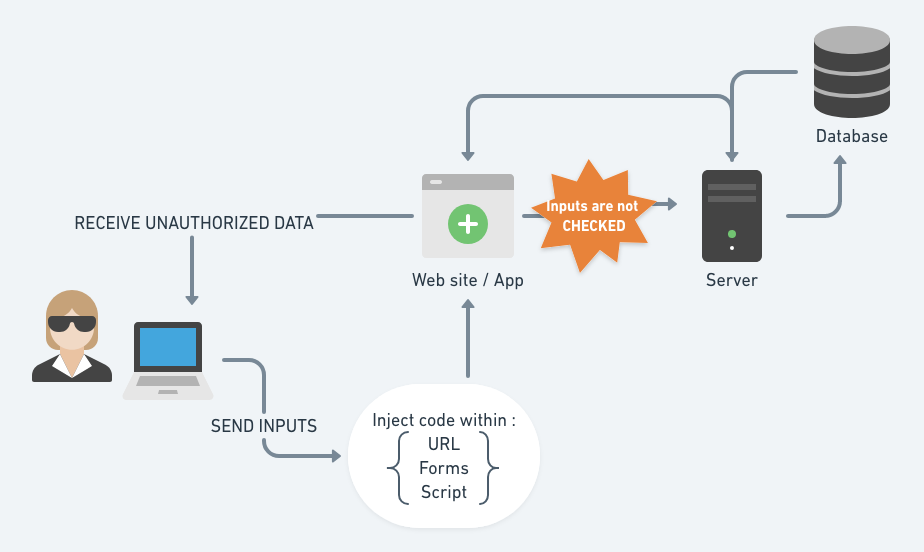
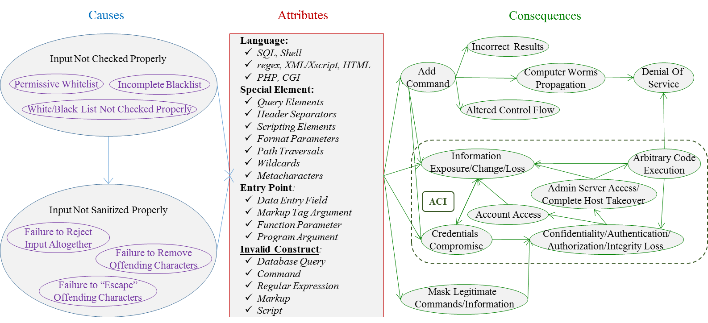

import { Head } from 'mdx-deck'
import {  Box } from 'grid-styled'
export { default as theme } from 'theme'

<Head>
  <title> 💉 Arbitrary Code Injection & Execution aka ACI/ACE ⚙️ </title>
</Head>

💉 Arbitrary Code Injection & Execution aka ACI/ACE ⚙️ 

---

#Arbitrary Meaning  🔍 

Based on random choice or personal whim, rather than any reason or system.

---

#ACI  💉 

Injection means to insert code or commands in a machine or a process .
It occurs when an application or a process evaluates inputs without validating it first

---
#ACE  ⚙️ 

Its an attacker's ability to execute arbitrary commands or code on a target machine or a target process  by using an exploit.
For the purpose of process/machine behaviors changes.
---

#Simple Overview

---

#Reality

---
#Causes 🤷🏻‍♂️

- Input not checked properly 
- Input not sanitized properly 
- Language native Functions (fprintf, printf, sprintf, setproctitle, syslog )
- OS native Libraries (WIN API => Kernel32.dll, User32.dll and GDI32.dll)
- eval()(Unsafe & Dangerous function in PHP & JS)
---

Different Type Injection 
- SQL Injection (Insert arbitrary SQL commands in database queries)
- OS Command Injection (Insert arbitrary commands in SHELL calls)
- LDAP Injection (Alter the logic of an LDAP Query)
- XPath Injection (Alter the logic of an XPath search)
- DLL Injection  (Alter behavior of a program by using external programs)
- Buffer overflow (	Alters the flow of an application by overwriting parts of memory.)

---

#Make your code TANKY 🛡️

---

There is no secrets ✨ to prevent ACE & ACI :
 - Manage your buffer and memory allocation with security rules 
 - Check & Control your method & functions access
 - Check your data type, values 
 - Restrict Data & Native functions to your final user
 - Dont use unsafe methods/functions
 - Use prepared Queries

---
#ACE attacks ⚔️

**Microsoft Windows 10** 
On June 12, 2018, Mozilla 🦊 discovered an ACE vulnerability in Microsoft Windows 10. 
by Jean-Yves Avenard

**7-Zip** 
On May 1, a security researcher discovered an ACE vulnerability in the 7-Zip file archiver. 

**PHP** 
It has been the subject of numerous ACE vulnerabilities 😂

---

<Box style={{fontSize:"28px"}}>
Sources 
https://en.wikipedia.org/wiki/Arbitrary_code_execution
https://www.ibm.com/support/knowledgecenter/fr/SSB2MG_4.6.0/com.ibm.ips.doc/concepts/wap_injection_attacks.html
https://www.synopsys.com/blogs/software-security/detect-prevent-and-mitigate-buffer-overflow-attacks/
https://lab.hakim.se/rymd/
https://beta.hackndo.com/buffer-overflow/
https://docs.microsoft.com/en-us/windows/desktop/apiindex/windows-api-list
https://www.go4expert.com/articles/understanding-arbitrary-eval-code-t26408/
https://samate.nist.gov/BF/Classes/INJ.html (NICE ONE GUYS )
</Box>

---

#Any questions ? 

---